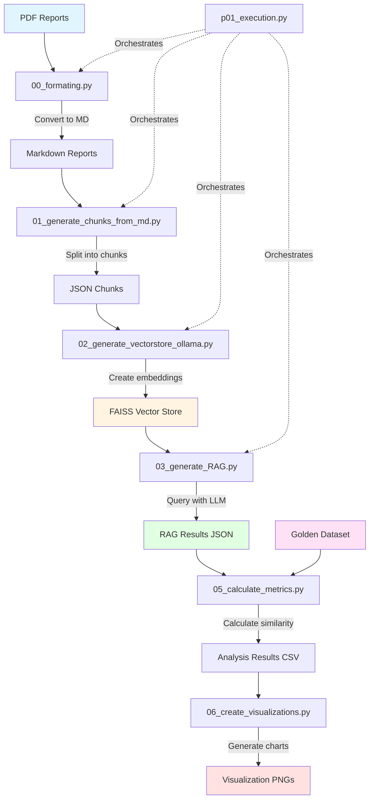

# ESG AI Report Extraction

An automated system for extracting and analyzing Environmental, Social, and Governance (ESG) data from corporate sustainability reports using AI-powered Retrieval-Augmented Generation (RAG).

## Overview

This project processes PDF sustainability reports from multiple companies, extracts key ESG metrics (particularly carbon emissions data), and evaluates the accuracy of the extracted information using semantic similarity and numerical matching techniques.

## Features

- **Automated PDF Processing**: Convert PDF reports to structured markdown format
- **Intelligent Text Chunking**: Split large documents into manageable chunks for processing
- **Vector Store Generation**: Create FAISS vector embeddings using Ollama
- **RAG-based Q&A**: Extract specific ESG metrics using LLM-powered question answering
- **Accuracy Evaluation**: Compare extracted data against golden datasets using:
  - Numeric matching
  - Semantic similarity (cosine similarity)
  - Source text verification
- **Visualization**: Generate publication-quality charts for analysis results

## Architecture Flowchart



## Pipeline Stages

### Stage 1: PDF to Markdown Conversion
**Script**: `00_formating.py`
- Converts PDF sustainability reports to markdown format
- Uses PyMuPDF4LLM for accurate text extraction
- Preserves document structure and layout

### Stage 2: Text Chunking
**Script**: `01_generate_chunks_from_md.py`
- Splits markdown documents into overlapping chunks
- Chunk size: 1000 characters
- Overlap: 200 characters
- Outputs JSON array of text chunks

### Stage 3: Vector Store Creation
**Script**: `02_generate_vectorstore_ollama.py`
- Generates embeddings using Ollama's `nomic-embed-text` model
- Creates FAISS vector index for efficient similarity search
- Numbers chunks for traceability

### Stage 4: RAG Question Answering
**Script**: `03_generate_RAG.py`
- Queries the vector store with specific ESG questions:
  1. **Q1**: Total Scope 1 (Direct) GHG emissions
  2. **Q2**: Target year for Net Zero emissions
  3. **Q3**: Carbon reduction initiatives
- Uses Ollama's `qwen2.5:1.5b` LLM
- Returns structured JSON with answers and source text

### Stage 5: Accuracy Evaluation
**Script**: `05_calculate_metrics.py`
- Compares RAG results against golden dataset
- Metrics:
  - **Numeric Match**: Exact number matching for Q1 & Q2
  - **Source Containment**: Validates numbers exist in source text
  - **Semantic Similarity**: Cosine similarity for Q3 (initiatives)
- Outputs CSV with detailed analysis

### Stage 6: Visualization
**Script**: `06_create_visualizations.py`
- Generates publication-quality charts (300 DPI)
- Visualizations:
  - Accuracy metrics (bar charts)
  - Semantic similarity scores (horizontal bar charts)
- Saves to `files/Results/` directory

## Installation

### Prerequisites
- Python 3.8+
- Ollama installed and running
- Required Ollama models pulled

### Setup

1. Clone the repository:
```bash
git clone https://github.com/csmoilis/esg_ai_report_extraction.git
cd esg_ai_report_extraction
```

2. Install Python dependencies:
```bash
pip install pymupdf4llm markdown beautifulsoup4 langchain langchain-ollama \
    langchain-community faiss-cpu sentence-transformers scikit-learn \
    rapidfuzz pandas matplotlib seaborn
```

3. Pull required Ollama models:
```bash
ollama pull nomic-embed-text
ollama pull qwen2.5:1.5b
```

## Usage

### Pipeline Orchestration

Run the complete pipeline for all reports:
```bash
python p01_execution.py
```

This script reads from `files/reports_companies.json` and processes each report through the selected pipeline stage.

### Individual Scripts

Process a single report through each stage:

```bash
# Step 1: Convert PDF to Markdown
python 00_formating.py <report_name> <company_name>

# Step 2: Generate chunks
python 01_generate_chunks_from_md.py <report_name> <company_name>

# Step 3: Create vector store
python 02_generate_vectorstore_ollama.py <report_name> <company_name>

# Step 4: Run RAG queries
python 03_generate_RAG.py <report_name> <company_name>

# Step 5: Calculate metrics (after all reports processed)
python 05_calculate_metrics.py

# Step 6: Generate visualizations
python 06_create_visualizations.py
```

### Configuration Files

**reports_companies.json** format:
```json
[
    {
        "report_name": "FY2024-NVIDIA-Corporate-Sustainability-Report",
        "company_name": "NVIDIA"
    },
    {
        "report_name": "Amazon-Sustainability-Report-2024",
        "company_name": "Amazon"
    }
]
```

## Directory Structure

```
esg_ai_report_extraction/
├── files/
│   ├── reports/              # Input PDF files
│   ├── MD_reports/           # Converted markdown files
│   ├── Chunks/               # JSON chunks
│   ├── faiss/                # FAISS vector indices
│   └── Results/              # Output visualizations
├── 00_formating.py           # PDF to MD converter
├── 01_generate_chunks_from_md.py
├── 02_generate_vectorstore_ollama.py
├── 03_generate_RAG.py        # Main RAG pipeline
├── 04_update_json_names.py   # Dataset name mapping
├── 05_calculate_metrics.py   # Evaluation metrics
├── 06_create_visualizations.py
├── i01_get_k_insight.py      # Insight analysis tool
├── p01_execution.py          # Pipeline orchestrator
└── README.md
```

## Output Files

- **RAG_results_TINY.json**: Extracted answers and source texts for all companies
- **rag_analysis_results.csv**: Detailed evaluation metrics
- **files/Results/*.png**: Visualization charts

## Evaluation Metrics

### Question 1 & 2 (Numeric Data)
- **Numeric Match**: Exact match between extracted and golden answer numbers
- **In Source**: Verification that numbers exist in cited source text
- **Source Similarity**: Cosine similarity between RAG and golden source texts

### Question 3 (Narrative Data)
- **Answer Similarity**: Semantic similarity of initiative descriptions
- **Source Similarity**: Semantic similarity of source text excerpts

## Contributing

Contributions are welcome! Please feel free to submit pull requests or open issues.

## License

This project is available for educational and research purposes.

## Acknowledgments

- Built with [LangChain](https://www.langchain.com/) and [Ollama](https://ollama.ai/)
- Uses [FAISS](https://github.com/facebookresearch/faiss) for vector similarity search
- PDF processing powered by [PyMuPDF4LLM](https://github.com/pymupdf/PyMuPDF)
